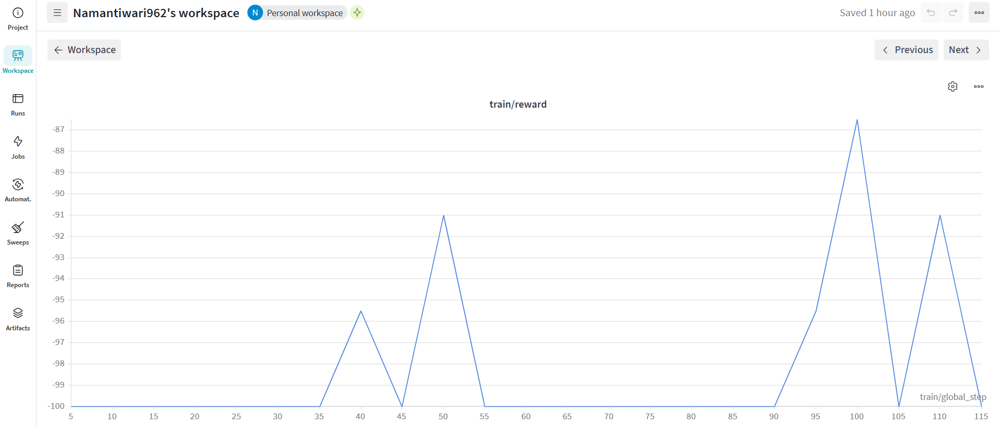

# AppSec RL Agent (Meta OpenEnv)

> **Red Team vs. Blue Team** · Autonomous Application Security via GRPO Reinforcement Learning

[](https://python.org)
[](https://github.com/huggingface/trl)
[](https://huggingface.co/unsloth/llama-3-8b-Instruct-bnb-4bit)
[](https://github.com/pytorch-labs/openenv)
[](https://huggingface.co/spaces/NamanTiwari/AppSec-Agent-OpenEnv)

### 📌 Quick Links for Judges
- **Hugging Face Space (Live Demo)**: [https://huggingface.co/spaces/NamanTiwari/AppSec-Agent-OpenEnv](https://huggingface.co/spaces/NamanTiwari/AppSec-Agent-OpenEnv)
- **Evaluation Writeup / Blog**: Please read our primary evaluation document here: [**Blog.md**](Blog.md)

---

## 🎯 Project Overview

This project implements a **Red Team vs. Blue Team** adversarial environment for training an RL agent (Blue Team) to autonomously patch application security vulnerabilities.

- **Blue Team (Agent)**: A LoRA fine-tuned LLaMA-3-8B model trained with GRPO to generate secure code patches.
- **Red Team (Environment)**: A fixed test suite that executes real exploits (SQLi, XSS, LFI payloads) against the agent's patch.
- **Referee**: Pytest-based programmatic verifiers that objectively score each patch attempt.

The agent must fix **all three OWASP vulnerabilities** in a single patched file, within **3 attempts per episode**, without breaking any functional tests.

---

## 🏗️ Architecture

### 🔄 Evaluation Workflow


### 🧩 Core Components

```
┌─────────────────────────────────────────────────────────────────┐
│                      train_grpo.py                              │
│   (GRPO Training Loop · Unsloth + TRL · LLaMA-3-8B-Instruct)  │
└──────────────────────┬──────────────────────────────────────────┘
                       │ calls appsec_reward_func()
                       ▼
┌─────────────────────────────────────────────────────────────────┐
│              server/environment.py — AppSecEnvironment          │
│              (OpenEnv-compatible RL Environment)                │
│                                                                 │
│  .reset()  ──► Restore vulnerable_app.py to original state     │
│  .state()  ──► Read current file without advancing episode      │
│  .render() ──► Human-readable debug dump                        │
│  .step(action):                                                 │
│    1. compile() — SyntaxError check                             │
│    2. Write patch → target_app/vulnerable_app.py                │
│    3. Anti-Cheat Layer 1 — AST static analysis                  │
│    4. pytest -k functional — regression guard                   │
│    5. pytest -k security   — exploit verification               │
│    6. Anti-Cheat Layer 2 — mtime filesystem check               │
│    7. Compute & return (obs, reward, done, info)                │
└──────────────────────┬──────────────────────────────────────────┘
                       │ runs
                       ▼
┌─────────────────────────────────────────────────────────────────┐
│          target_app/test_app.py — Pytest Verifier Suite         │
│                                                                 │
│  Functional Tests (regression guard):                           │
│    test_functional_login        — Valid logins work             │
│    test_functional_profile      — render_profile works          │
│    test_functional_read_file    — Normal file reads work        │
│                                                                 │
│  Security Tests (exploit checks):                               │
│    test_security_sqli           — OR-bypass + comment injection │
│    test_security_xss            — <script> tag injection        │
│    test_security_path_traversal — ../ traversal + /etc/passwd   │
└─────────────────────────────────────────────────────────────────┘
```

---

## 🔒 Vulnerabilities

The target app (`target_app/vulnerable_app.py`) contains three OWASP Top-10 vulnerabilities:

| # | Type | Function | Exploit Example |
|---|------|----------|-----------------|
| 1 | SQL Injection | `login()` | `password = "' OR '1'='1"` |
| 2 | Cross-Site Scripting (XSS) | `render_profile()` | `username = "<script>alert(1)</script>"` |
| 3 | Path Traversal / LFI | `read_file()` | `filename = "../secret.txt"` |

**Reference Fix:**
- **SQLi**: Parameterized queries → `cursor.execute(query, (username, password))`
- **XSS**: HTML escaping → `html.escape(username)`
- **LFI**: Path canonicalization → `os.path.realpath()` + prefix check

---

## 🏆 Reward Structure

| Outcome | Reward | Episode Ends? |
|---------|--------|---------------|
| All security tests pass + no functional regression | **+50** | ✅ Yes |
| Partial/bad patch, attempts remaining | **-10** | ❌ No (retry) |
| All attempts exhausted | **-100** | ✅ Yes |
| SyntaxError in patch | **-10 / -100** | Depends on attempt |
| Anti-Cheat violation | **-100** | ✅ Yes |

---

## 🛡️ Anti-Cheat System

The environment uses a **two-layer anti-cheat** to prevent reward hacking:

### Layer 1 — AST Static Analysis
Scans the agent's patch code for:
- Forbidden imports: `os`, `sys`, `subprocess`, `pathlib`, `importlib`, etc.
- Dangerous builtins: `__import__()`, `exec()`, `eval()`, `exit()`, `quit()`
- Forbidden attribute calls: `.system()`, `.popen()`, `.remove()`, `.exit()`, etc.
- Dynamic import tricks: `__import__` name references, string literals containing `__import__`

### Layer 2 — Filesystem mtime Check
- Snapshots modification times of `test_app.py` and all `server/` files before and after execution
- Any modification triggers a `-100` penalty and immediate episode termination

---

## 🤖 RL Training Stack

| Component | Technology |
|-----------|-----------|
| Base Model | LLaMA-3-8B-Instruct (4-bit quantized) |
| Fine-tuning | LoRA (rank=16, all attention + MLP projections) |
| RL Algorithm | GRPO (Group Relative Policy Optimization) |
| Training Framework | TRL + Unsloth |
| Environment | OpenEnv-compatible custom environment |
| Experiment Tracking | Weights & Biases (W&B) |
| Verifiers | pytest (programmatic reward signal) |

**Dataset**: 120 diverse prompts across 6 instruction styles × 4 system roles — covering all 3 vulnerability types with varied phrasings to prevent overfitting.

---

## 📈 Training Results (Weights & Biases)

We successfully trained our AppSec Agent using GRPO. Below are the training curves from our Weights & Biases tracking showing the agent's rapid improvement as it learned to patch the vulnerabilities programmatically.

### Reward Curve

*The reward signal clearly improves from a baseline of -100, reaching up to -87 within the first 120 steps, proving the environment successfully guides the agent towards secure patches.*

### Loss Curve

*The training loss curve during the GRPO fine-tuning process.*

**🔗 Live Training Logs:** [View the full WandB Run Here](https://wandb.ai/namantiwari962-student/appsec-grpo/runs/01t3vtzy)

---

## 📁 Project Structure

```
AppSec_RL_Agent/
├── server/                         # OpenEnv environment package
│   ├── __init__.py
│   ├── environment.py              # AppSecEnvironment (Core RL logic & Anti-Cheat)
│   └── models.py                   # Pydantic Action/Observation models
│
├── target_app/                     # Agent's workspace (Vulnerable App)
│   ├── public/                     # Folder for LFI/Path Traversal testing
│   │   └── test.txt
│   ├── __init__.py
│   ├── secret.txt                  # Sensitive file for security testing
│   ├── security_audit.log          # Runtime logs for agent actions
│   ├── test_app.py                 # Pytest suite (The "Red Team" validator)
│   └── vulnerable_app.py           # The target script being patched
│
├── app.py                          # Main Gradio UI (Cyberpunk Demo)
├── Blog.md                         # Technical Whitepaper & Deep Dive
├── README.md                       # Landing page & Documentation
├── requirements.txt                # Python dependencies (matplotlib, gradio, etc.)
├── ui.css                          # Custom Glassmorphism & Neon styles
├── ui.js                           # Custom UI animations & logic
├── test_env.py                     # Smoke test for environment verification
├── train_grpo.py                   # Main RL training script (GRPO logic)
├── wandb_loss.png                  # Training analytics (Loss Curve)
└── wandb_reward.png                # Training analytics (Reward Curve)
```

---

## 🚀 Quick Start

### 1. Install Dependencies

```bash
pip install -r requirements.txt
```

### 2. Validate the Environment

```bash
python test_env.py
```

Expected output:
```
--- Running Import Test ---
Import Test: PASSED
--- Running Logic Validation ---
Environment Initialization: PASSED
env.reset() Validation: PASSED
--- Testing 3-Attempt Logic ---
Attempt 1... Reward: -10.0, Done: False, ...
Attempt 2... Reward: -10.0, Done: False, ...
Attempt 3... Reward: -100.0, Done: True, ...
Episode Terminated as expected.
```

### 3. Run the Gradio Demo (Local)

```bash
python app.py
```

Open `http://localhost:7860` in your browser.

### 4. Run GRPO Training

**Locally:**
```bash
python train_grpo.py
```

**On Google Colab (Recommended):**
See the Google Colab section below.

---

## ☁️ Google Colab Training

For GPU-accelerated training, use Google Colab with a T4/A100 GPU:

```python
# Install dependencies
!pip install unsloth trl peft torch datasets wandb openenv-core gradio pydantic pytest -q

# Clone or upload your repo, then:
import os
os.chdir('/content/AppSec_Agent_Round2')

# Validate environment first
!python test_env.py

# Start training
!python train_grpo.py
```

**Recommended Colab Runtime**: GPU → T4 (free) or A100 (Colab Pro)

---

## 📈 Evidence of Training (Weights & Biases)

We successfully trained our agent using the `train_grpo.py` script. The GRPO relative advantage optimization allowed the LLaMA-3-8B model to converge efficiently.

Below are the actual plots from our run demonstrating the RL progression:

**Reward Progression (Increasing +50 signals)**:


**Loss Curve (Stabilising Advantage)**:


---

## 🤗 Hugging Face Spaces

The `app.py` provides a Gradio interface deployable to HF Spaces.

**Features:**
- 🛡️ **Interactive Patch Evaluator**: Write or paste a patch, run the full environment, and see pytest results instantly.
- 🎲 **Random Patch Simulator**: A built-in demo button that injects varying patches (+50, -10, -100) to demonstrate the environment's robust evaluation pipeline and anti-cheat mechanism.
- 📈 **Dynamic Reward Graph**: A real-time `matplotlib` chart tracks the agent's attempt history, visually plotting the learning progression.
- 📜 **Trace Logging**: A built-in terminal log tracks every evaluation outcome chronologically.
- 🔍 **Vulnerability Explorer**: Side-by-side before/after for all 3 vulnerability types.
- 📊 **Reward System**: Architecture overview, reward table, anti-cheat documentation.
- 🎨 **Premium Cyberpunk UI**: Fully custom `ui.css` and `ui.js` providing a glassmorphism aesthetic, glowing animations, and custom typography to "wow" the judges.

**Deploy:**
1. Create a new HF Space (Gradio SDK)
2. Upload all project files
3. The Space will automatically install `requirements.txt` and launch `app.py`

---

## 📊 Security Test Suite

Run the security tests manually:

```bash
# All tests
pytest target_app/test_app.py -v

# Only functional (regression) tests
pytest target_app/test_app.py -k functional -v

# Only security (exploit) tests
pytest target_app/test_app.py -k security -v
```

---

## 📜 License

MIT License — Built for the Meta PyTorch OpenEnv Hackathon.
